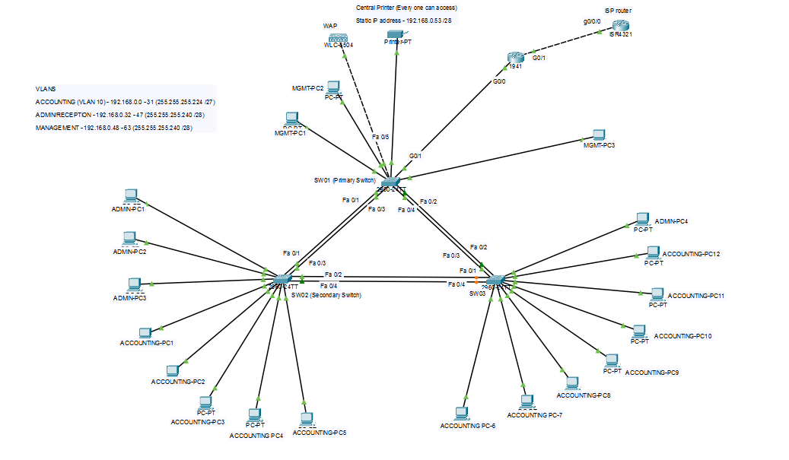

# Lab 01 — Bright Leaf Accounting (Small Office)

A small office network for a 3-partner accounting firm with three departments: Accounting, Admin/Reception, and Management. Each department needed its own segment, DHCP, shared access to one printer, and internet access, while unauthorized devices shouldn't be able to reach anything sensitive.

## Topology

- **1 router** (`BrightLeaf-RT`) — handles inter-VLAN routing, DHCP, and NAT out to the internet
- **1 router** (`ISP`) — simulates the internet, with loopback addresses used to test reachability
- **3 access switches** (`SW01`, `SW02`, `SW03`) — connected in a triangle for redundancy, with EtherChannel bundling the links between them
- **1 wireless access point** and **1 shared printer**, both connected to SW01

## Addressing

| VLAN | Department | Subnet | Gateway |
|---|---|---|---|
| 10 | Accounting | 192.168.0.0/27 | 192.168.0.1 |
| 20 | Admin/Reception | 192.168.0.32/28 | 192.168.0.33 |
| 30 | Management | 192.168.0.48/28 | 192.168.0.49 |
| 50 | Switch management (SVI) | 192.168.0.48/28 | — |
| 99 | Unused ports (dead VLAN) | — | — |
| 999 | Native VLAN for trunk links | — | — |

Subnet sizes were picked based on expected staff count per department, with room to grow. DHCP hands out addresses in each VLAN, with the router, gateway, and printer addresses excluded from the DHCP pool so they can't be handed out to a random device.

## Design decisions

**Inter-VLAN routing is allowed between all departments.** The requirement was that departments shouldn't be able to sniff each other's traffic, which VLAN segmentation already takes care of i.e each department is its own broadcast domain. On top of that, routing between VLANs is left open on purpose, so departments can send documents to each other and everyone can reach the shared printer, which lives in the Management VLAN. This was a deliberate choice to support normal day-to-day office communication, not an oversight.

**Switch management (VLAN 50) shares an IP range with the Management VLAN.** The three switches each have a management SVI (192.168.0.50, .51, .52) inside the same subnet used by the Management department (192.168.0.48/28), even though VLAN 50 is a separate VLAN tag from VLAN 30. This was intentional (it lets the Management department reach the switches directly for administration, without needing a router subinterface dedicated to VLAN 50.)

**Only Management can SSH or Telnet into the switches.** A standard ACL (`MGMT_RESTRICT`) is applied to the VTY lines on every switch, permitting only addresses from the Management subnet and denying everyone else. The reasoning: department staff shouldn't have any way to log into network infrastructure, that should be the Management team's job alone.

**Unused switch ports are isolated in a dead VLAN (99) and administratively shut down.** VLAN 99 is deliberately left out of every trunk's allowed VLAN list, so even before the shutdown was added, a device plugged into one of these ports had no path off its local switch. The `shutdown` command adds a second layer on top of that.

**Trunk links use a dedicated native VLAN (999), not VLAN 1.** Using the default VLAN as a native VLAN is a common attack surface for VLAN hopping. Moving the native VLAN to an unused, deliberately empty VLAN closes that off.

**SW01 is the STP root, SW02 is the secondary root.** Spanning-tree priorities are set explicitly (SW01 lowest, SW02 next) rather than left to a default election, so the root position is predictable and won't shift unexpectedly if a new switch is added later. Rapid PVST+ is used for faster convergence than legacy STP.

**Redundant links between switches use EtherChannel (LACP).** Each pair of switches has two physical links bundled into a single logical link, so losing one cable doesn't mean losing the connection, traffic just shifts to the remaining link in the bundle.

**NAT overload (PAT) gets the whole office online through one public IP.** All three department subnets are translated behind the router's single public-facing address on the link to the ISP router.

## Configs

Full running-configs for every device are in [`configs/`](./configs).

## What I'd improve next

If departments ever needed to be walled off from each other (not just separated from sniffing each other), the next step would be adding ACLs on the router's subinterfaces to control specifically what can pass between VLANs, rather than leaving routing fully open.
