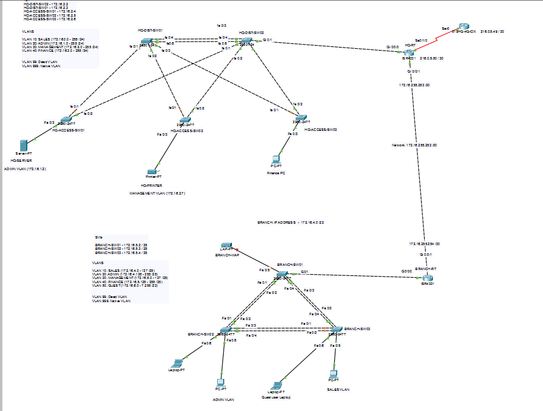

# Lab 02: Coastline Retail Group (2-Site WAN, Static Routing)

A two-site network for a retail company with a Head Office and a Branch store connected over a WAN link. Both sites have their own departments (Sales, Admin, Management, Finance), the Branch also has a Guest wireless network, and HQ's Finance subnet has to stay unreachable from the Branch. Static routing only, no dynamic routing protocol yet.

## Topology

**HQ** uses a collapsed core design:
- **1 router** (`HQ-RT`), handles inter-VLAN routing, NAT, and the WAN link to Branch
- **2 distribution switches** (`HQ-DIST-SW01`, `HQ-DIST-SW02`), linked to each other and to every access switch
- **3 access switches** (`HQ-ACCESS-SW01/02/03`), each connected to both distribution switches for redundancy
- A server and a printer connected off the access layer

**Branch** is a flatter design:
- **1 router** (`BRANCH-RT`), handles inter-VLAN routing for the branch's own VLANs and routes everything else, including internet-bound traffic, back to HQ
- **3 switches** (`BRANCH-SW01/02/03`) connected in a triangle, with EtherChannel (LACP) bundling the links between them
- **1 wireless access point** for the Guest VLAN

The two sites connect over a point-to-point WAN link between `HQ-RT` and `BRANCH-RT`.

## Addressing

**HQ (172.16.0.0/22):**

| VLAN | Department | Subnet | Gateway |
|---|---|---|---|
| 10 | Sales | 172.16.0.0/24 | 172.16.0.1 |
| 20 | Admin | 172.16.1.0/24 | 172.16.1.1 |
| 30 | Management (includes distribution/access switch SVIs) | 172.16.2.0/24 | 172.16.2.1 |
| 40 | Finance | 172.16.3.0/24 | 172.16.3.1 |
| 99 | Unused ports (dead VLAN) | n/a | n/a |
| 999 | Native VLAN for trunk links | n/a | n/a |

**Branch (172.16.4.0/22):**

| VLAN | Department | Subnet | Gateway |
|---|---|---|---|
| 10 | Sales | 172.16.4.0/25 | 172.16.4.1 |
| 20 | Admin | 172.16.4.128/25 | 172.16.4.129 |
| 30 | Management (includes switch SVIs) | 172.16.5.0/25 | 172.16.5.1 |
| 40 | Finance | 172.16.5.128/25 | 172.16.5.129 |
| 50 | Guest (wireless) | 172.16.6.0/23 | 172.16.6.1 |
| 99 | Unused ports (dead VLAN) | n/a | n/a |
| 999 | Native VLAN for trunk links | n/a | n/a |

The WAN link between the two routers sits on its own point-to-point subnet, 172.16.255.252/30.

## Design decisions

**Only HQ has internet breakout, Branch routes everything through HQ.** BRANCH-RT has no NAT configuration at all. Its default route points straight at HQ-RT across the WAN link, so all Branch traffic headed for the internet, including Guest wireless traffic, rides the WAN link to HQ and gets translated there. HQ-RT's NAT ACL explicitly includes Branch's address range for this reason. This was a deliberate cost decision: standing up a second internet connection and NAT setup at the Branch isn't worth it for a company this size when one shared breakout point at HQ does the job.

**HQ's router only has one physical uplink from the distribution layer, on HQ-DIST-SW02.** The two distribution switches are fully redundant with each other and with every access switch, but the path from distribution to the router itself isn't redundant yet, if HQ-DIST-SW02 or that specific link fails, HQ loses its route out. This is a known, deliberate simplification for this stage of the project. Fixing it properly means adding a second router uplink and running a first-hop redundancy protocol (FHRP) so both distribution switches can act as an active gateway, which is planned for a later lab once dynamic routing (OSPF/EIGRP) is in place first.

**HQ's access switches are dual-homed to both distribution switches instead of using EtherChannel.** Each access switch has one link to each distribution switch, with Spanning Tree deciding which one is active. EtherChannel can't be used here because a channel-group has to terminate on the same pair of devices, a link to Distribution-SW01 and a link to Distribution-SW02 are two separate logical links no matter how they're configured, so they can't be bundled together. Dual-homing to two independent switches, with STP handling the failover, is the correct form of redundancy for this topology. This is different from the Branch site, where all three switches connect to each other directly, so EtherChannel bundling between them is possible there.

**HQ's Finance VLAN is blocked from the Branch entirely.** An extended ACL (`FINANCE-ACL`) is applied inbound on HQ-RT's WAN interface, denying anything destined for the Finance subnet (172.16.3.0/24) before it can enter the router, while permitting everything else. Since it's applied on the WAN-facing interface specifically, this only blocks traffic arriving from the Branch side, not from HQ's own internal VLANs.

**Branch's Guest VLAN can reach the internet, but nothing internal at either site.** An extended ACL (`GUEST_ACL`) is applied inbound on the Guest subinterface at BRANCH-RT, denying traffic to both the Branch's own internal ranges and HQ's internal ranges, then permitting everything else. A guest device on the wireless network can get online but has no path to either site's internal VLANs.

**Switch management SVIs sit directly on VLAN 30 at both sites, with a VTY ACL as a second layer.** Same pattern used in Lab 01: the management SVI lives in the same VLAN as the Management department, so VLAN membership is the real gate, and a standard ACL on the VTY lines (permitting only the local Management subnet) backs it up as defense in depth.

**Unused ports are isolated in a dead VLAN (99) and shut down, trunk links use a dedicated native VLAN (999).** Same reasoning as Lab 01: VLAN 99 is left out of every trunk's allowed VLAN list and administratively shut down, so an unused port has no path anywhere even before the shutdown is considered. VLAN 999 keeps the native VLAN off the default VLAN 1.

**Routing is entirely static, no dynamic routing protocol yet.** Both routers use static default routes, and HQ-RT has one additional static route pointing Branch's subnet range back across the WAN link. This is intentional for this stage, dynamic routing (starting with EIGRP, then OSPF) comes in a later lab.

## Configs

Full running-configs for every device are in [`configs/`](./configs).

## What I'd improve next

Adding a second router uplink from HQ-DIST-SW01 and running a first-hop redundancy protocol (HSRP or VRRP) would close the single point of failure between the distribution layer and the router. Replacing the static routes with a dynamic routing protocol would also let the router advertise a default route automatically (for example, OSPF's default-information originate) instead of relying on hand-typed static routes on both ends.
